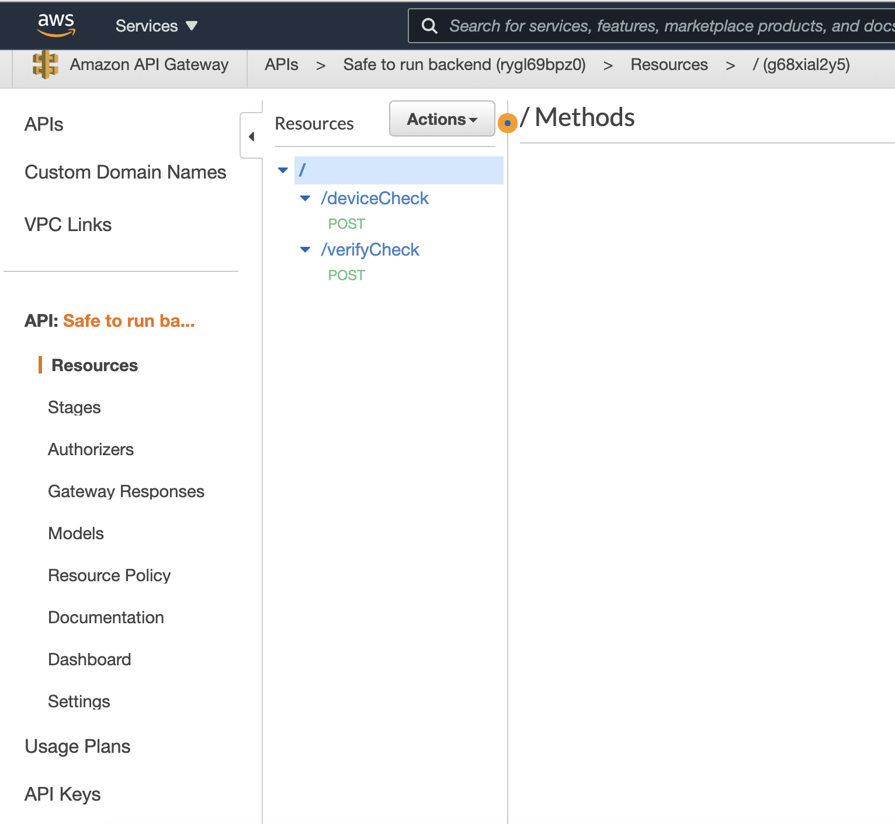
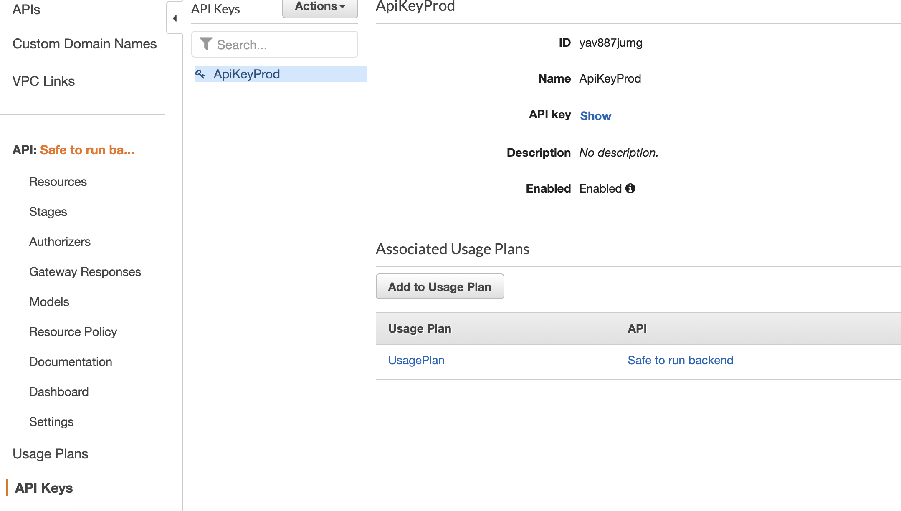

:::note

If you don't intend on running 'Off device' you can skip this section.

:::

The safe to run backend is designed to run using API Gateway and AWS lambda. This makes it incredibly cheap to run and
easily scalable.

## Deployment

### Prerequisites

Install and configure the AWS CLI here:

[AWS Install CLI](https://docs.aws.amazon.com/cli/latest/userguide/cli-chap-install.html)

### Install

Clone this repository, and then execute the following commands:

```shell
./gradlew :SafeToRunBackend:build :SafeToRunBackend:shadowJar
cp SafeToRunBackend/build/libs/SafeToRunBackend-0.1-all.jar .
sam package --template-file sam-template.yml --output-template-file sam-template-packages.yml --s3-bucket safe-to-run-lambda-bucket 
sam deploy --template-file sam-template-packages.yml --stack-name sam-safetorun-backend --capabilities CAPABILITY_IAM
```

This should print out the URL, to get the API key, go here:

https://eu-west-1.console.aws.amazon.com/apigateway/main/apis

#### Click on the 'Safe to run backend' and you will see the below



#### API Keys on the side, then click 'show'


